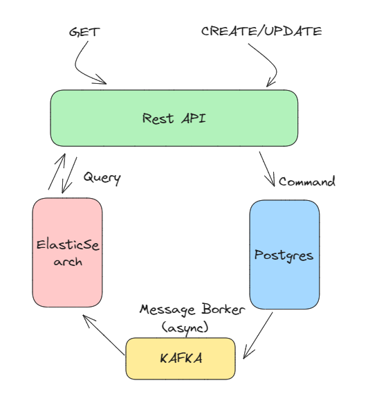

# CQRS (Command Query Responsibility Segregation) POC

- CQRS (Command Query Responsibility Segregation) is a software architecture pattern that aims to improve performance by separating the responsibilities of writing (command) and querying (query), but it introduces more complexity along with it.

- While developing this application, I separated the get (query) requests and the create/update/delete (command) operations, and stored them in different databases. I stored the commands in a relational database, specifically PostgreSQL. For the queries, I read from Elasticsearch. I implemented asynchronous operations between the two databases using Apache Kafka.

## CQRS Architecture



## Technologies

- Technologies I used during the construction of the project:
- Nest.js
- Typescript
- ElasticSearch
- Message Broker (Kafka)
- PostgreSql

## Prerequisites

- Docker
- Node
- Git

---

### Running application:

```
yarn start:dev
```

---

## Docker Run

Please follow the below directions in order to build and run the application with Docker Compose;

```sh
$ docker-compose up -d
```

Docker compose creates 6 replicas (instances) of the application.

### ElasticSearch

#### You can reach ElasticSearch page via `http://{HOST}:9200`

### Kibana

#### You can reach Kibana page via `http://{HOST}:5601`

### PostgreSql

#### You can reach PostgreSql page via `http://{HOST}:5555`

### Kafka

#### You can reach Kafka page via `http://{HOST}:9092`

### Kafka-UI

#### You can reach Kafka-UI page via `http://{HOST}:9090`

### Zookeeper

#### You can reach Zookeeper page via `http://{HOST}:2181`
